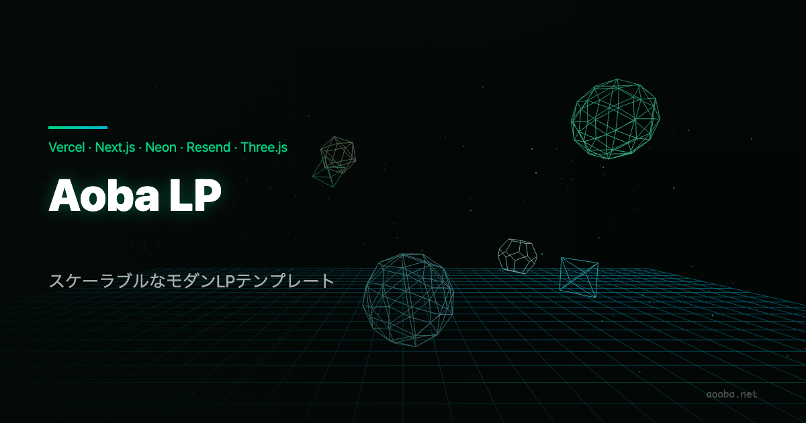
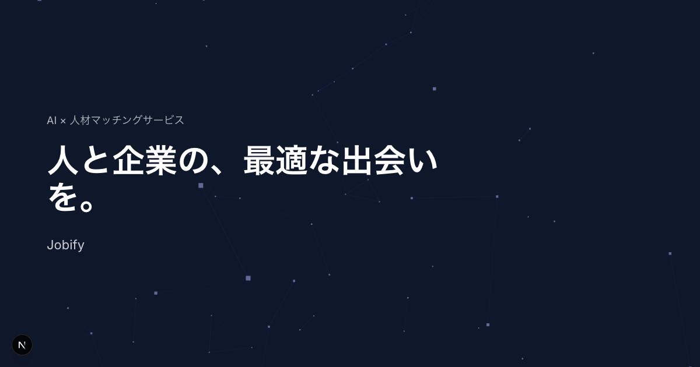
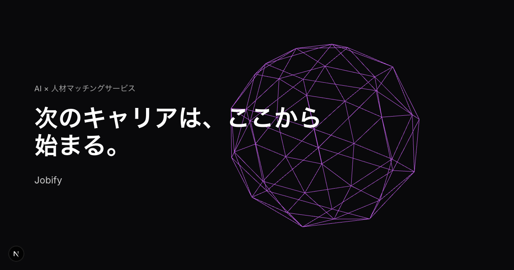
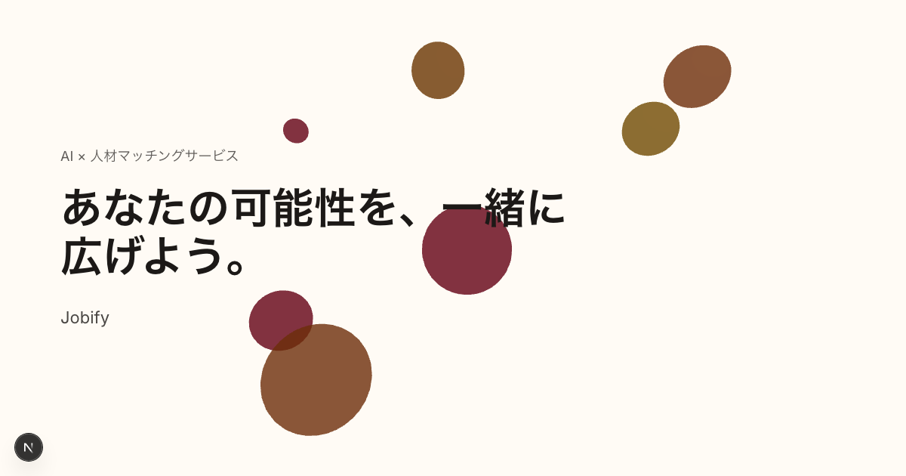

<p align="center">
  
</p>

<h1 align="center">Aoba LP</h1>

<p align="center">
  スモールスタートから商用スケールまで対応する、Next.js コーポレートサイト テンプレート
</p>

<p align="center">
  <a href="LICENSE"></a>
  
  
  
  
</p>

<p align="center">
  <strong>1 クリックVercelにデプロイ可能 (連携SaaSへの登録は別途必要)</strong>
</p>

<p align="center">
  <a href="https://vercel.com/new/clone?repository-url=https://github.com/AobaIwaki123/aoba-lp&env=DATABASE_URL,DATABASE_URL_UNPOOLED,UPSTASH_REDIS_REST_URL,UPSTASH_REDIS_REST_TOKEN,NEXT_PUBLIC_SITE_URL,RESEND_API_KEY,CONTACT_EMAIL,SLACK_WEBHOOK_URL">
    
  </a>
</p>

---

## なぜ Aoba LP を選ぶのか

| | |
|---|---|
| **Free Tier で始められる** | Vercel・Neon・Upstash・Resend の無料枠を活用。無料枠からスモールスタートし、事業成長に応じてシームレスにスケール可能 |
| **フォーム投稿が本番品質** | 問い合わせを DB 保存 → 管理者メール通知 → 投稿者への自動返信 → Slack 通知まで一気通貫。レート制限・冪等性キー・メールアドレス正規化済み |
| **A/B テストを内蔵** | Edge Runtime による Cookie ベースの振り分けで 3 種類のデザインコンセプトを即時切り替え。ゼロレイテンシ |
| **サーバー管理ゼロ** | Vercel（ホスティング）+ Neon（Serverless Postgres）+ Upstash（Serverless Redis）により、インフラ運用を完全アウトソース |
| **セキュリティ設計済み** | CSP・HSTS・X-Frame-Options 等のセキュリティヘッダー・スライディングウィンドウ式レート制限・SQL インジェクション対策（Drizzle ORM）・ハニーポットフィールドを標準装備 |
| **リッチな 3D 演出** | React Three Fiber による WebGL 3D アニメーション + Framer Motion によるインタラクション。モバイルでは CSS フォールバックに自動切替 |

---

## A/B テスト: 3 つのデザインコンセプト

Edge Runtime で Cookie を発行し、初回アクセス時にコンセプトを固定。再訪問時も同じデザインを表示します。

| A: CONNECTED | B: BOLD | C: HUMAN |
|:---:|:---:|:---:|
|  |  |  |
| Particle Network (WebGL) | Wireframe Icosahedron (WebGL) | Floating Spheres (WebGL) |
| ミニマル・テック | 調和・エレガント | 温かみ・ヒューマン |

---

## フォーム投稿パイプライン

```
ユーザー入力 (Zod + React Hook Form)
    ↓ Server Action
レート制限チェック (Upstash Redis, 10 req/時/IP)
    ↓
冪等性キーで重複排除
    ↓
Neon Postgres に保存
    ↓ 並列
管理者メール通知 (Resend) ─── 自動返信メール (Resend)
    ↓
Slack Webhook 通知
    ↓
/contact/success へリダイレクト
```

---

## テックスタック

| カテゴリ | 採用技術 | 選定理由 |
|---|---|---|
| **Framework** | Next.js 16 (App Router) | RSC・Server Actions・Edge Runtime を統合 |
| **Language** | TypeScript strict | 型安全を最優先 |
| **Styling** | Tailwind CSS v4 + shadcn/ui | デザイントークン管理とヘッドレス UI の組み合わせ |
| **3D / Animation** | React Three Fiber v9 + Framer Motion | WebGL 演出と UI アニメーションを分離管理 |
| **Database** | Neon (Serverless Postgres) + Drizzle ORM | コネクションプーリング不要・マイグレーション型安全 |
| **Rate Limit** | Upstash Redis | Edge 対応・スライディングウィンドウ・Free Tier 10,000 req/日 |
| **Email** | Resend | SPF/DKIM 設定済み・React メールテンプレート対応 |
| **Notifications** | Slack Webhook | 問い合わせをリアルタイムで Slack チャンネルに通知 |
| **Hosting** | Vercel | Edge Network・自動 Preview デプロイ・無料 SSL |

---

## コスト試算（Free Tier 活用時）

| サービス | 無料枠 | 月額コスト |
|---|---|---|
| Vercel (Hobby) | 商用利用可・帯域無制限 | $0 |
| Neon (Free) | 0.5 GB ストレージ・計算 0.19 CU/月 | $0 |
| Upstash Redis (Free) | 10,000 req/日 | $0 |
| Resend (Free) | 3,000 通/月 | $0 |
| Slack | Incoming Webhook | $0 |
| **合計** | | **$0〜** |

> 月間問い合わせ数が数百件規模になっても Free Tier で運用可能。スケールアップが必要になった時点で各サービスの有料プランに移行してください。

---

## クイックスタート

### 前提条件

- Node.js 20+、pnpm 9+
- 各サービスのアカウント（Vercel・Neon・Upstash・Resend・Slack App）

### 1. リポジトリのクローンと依存インストール

```bash
git clone https://github.com/AobaIwaki123/aoba-lp.git
cd aoba-lp
pnpm install
```

### 2. 環境変数の設定

```bash
cp .env.example .env.local
```

`.env.local` を編集して各サービスのキーを設定します（[環境変数一覧](#環境変数) を参照）。

### 3. DB マイグレーション

```bash
pnpm db:generate   # Drizzle マイグレーションファイルを生成
pnpm db:migrate    # Neon に適用
```

> マイグレーション後、Neon の SQL Editor で `updated_at` トリガーを手動実行してください（[database.md §5b](docs/database.md) 参照）。

### 4. 開発サーバー起動

```bash
pnpm dev           # http://localhost:3000
```

---

## 環境変数

| 変数名 | 必須 | 説明 |
|---|:---:|---|
| `DATABASE_URL` | ✅ | Neon の接続文字列（プーリング接続） |
| `DATABASE_URL_UNPOOLED` | ✅ | Neon の直接接続（マイグレーション用） |
| `UPSTASH_REDIS_REST_URL` | ✅ | Upstash Redis の REST URL |
| `UPSTASH_REDIS_REST_TOKEN` | ✅ | Upstash Redis の REST トークン |
| `NEXT_PUBLIC_SITE_URL` | ✅ | 本番サイトの URL（例: `https://aooba.net`）OGP・メール本文で使用 |
| `RESEND_API_KEY` | ✅ | Resend の API キー |
| `CONTACT_EMAIL` | ✅ | 管理者通知の宛先メールアドレス |
| `SLACK_WEBHOOK_URL` | ✅ | Slack Incoming Webhook URL |
| `RATE_LIMIT_BYPASS_KEY` | — | レート制限バイパス用シークレット（テスト用） |

---

## ディレクトリ構造

```
.
├── src/
│   ├── app/
│   │   ├── (marketing)/      # LP・about・contact・privacy-policy
│   │   └── api/contact/      # Webhook エンドポイント
│   ├── components/
│   │   ├── ui/               # shadcn/ui（手書き禁止）
│   │   ├── layout/           # Header・Footer
│   │   ├── sections/         # LP セクション（hero/ はバリアント別）
│   │   └── canvas/           # Three.js（'use client' 必須）
│   ├── lib/
│   │   ├── db/               # Drizzle クライアント・schema・queries
│   │   ├── variants/         # A/B テスト設定
│   │   ├── validations/      # Zod スキーマ（クライアント・サーバー共有）
│   │   ├── actions/          # Server Actions
│   │   └── email/            # Resend テンプレート
│   ├── proxy.ts              # A/B テスト Cookie 付与（Edge Runtime）
│   └── types/                # 共通型定義
├── docs/                     # 設計ドキュメント一覧
└── drizzle/                  # マイグレーションファイル
```

---

## ドキュメント

| ドキュメント | 概要 |
|---|---|
| [要件定義書](docs/requirements.md) | 機能・非機能要件、ページ構成、制約条件 |
| [アーキテクチャ設計書](docs/architecture.md) | システム構成図、レンダリング戦略、データフロー |
| [デザイン仕様書](docs/design.md) | 3 コンセプトの詳細、デザイントークン、A/B テスト設計 |
| [DB 設計書](docs/database.md) | テーブル定義、インデックス、マイグレーション手順 |
| [セキュリティ設計書](docs/security.md) | 脅威モデル、インシデント対応 |
| [セキュリティ実装ガイド](docs/security-impl.md) | 各対策のコード解説（実装者向け） |
| [実装ガイド](docs/implementation-guide.md) | フェーズ別タスク、コーディング規約 |
| [用語集](docs/glossary.md) | WebGL・冪等性キー・Edge Runtime 等の用語解説 |

---

## コントリビューティング

1. このリポジトリを Fork する
2. `git checkout -b feat/your-feature` でブランチを作成
3. コードを変更し `pnpm lint && pnpm tsc --noEmit && pnpm test --run` が通ることを確認
4. Pull Request を作成する

バグ報告・機能提案は [Issues](https://github.com/AobaIwaki123/aoba-lp/issues) から歓迎します。

---

## ライセンス

MIT License — 詳細は [LICENSE](LICENSE) を参照してください。

商用利用・改変・再配布自由です。コピーライト表記は不要ですが、スターを押していただけると励みになります ⭐
